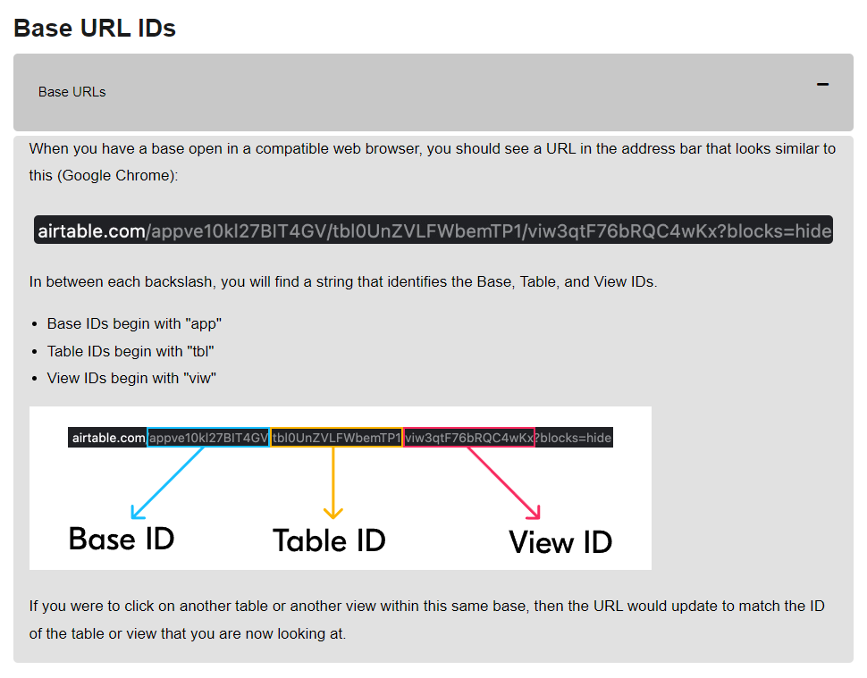

# Using

## Backup

1. Use script [backup.sh](backup.sh)
2. Change backup file path - parameter `-f psql_backup`

## App access to Airtable

1. Create personal access token, [guidelines here](https://airtable.com/developers/web/guides/personal-access-tokens).
2. Get base_id, and tables_id like described [here](https://airtable.com/developers/web/guides/personal-access-tokens) or here: 
3. If you do not have example of config - run app by script [sync.sh](sync.sh). Config file will be created
4. Replace in config file: 
   - `airtable_configuration.api_key` -> your personal access token
   - `airtable_configuration.database_id` -> your `BaseID`
   - `airtable_configuration.products_table_id` -> `TableID` of table with dataset products
   - `airtable_configuration.product_codes_table_id` -> `TableID` of table with Sigale product codes

## Thumbnails configuration

1. Dirs will be not created.
2. Dirs will be not cleaned.

# DEV
You need to install libpq-dev (Ubuntu) to be able to run `pip install -r requirements.txt` 

You could run db from [docker-compose.yml](docker-compose.yml)

