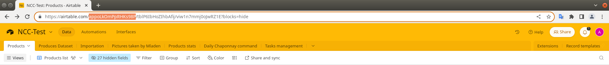
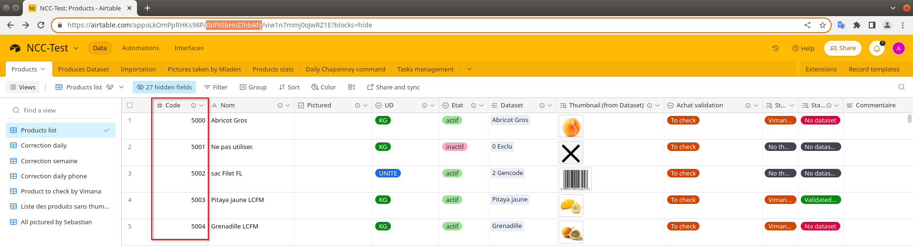
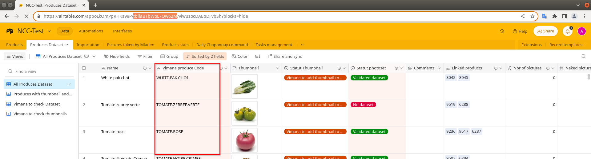

# Airtable utilities

## Store codes grabber
Downloads all numeric store codes (e.g.: 5310, 5305) for a list of IA alphabetic codes. 
Use [run_code_grabber.sh](./run_code_grabber.sh) to run it. It takes two arguments:
* a source file with alphabetic codes 
* a destination file, to save grabbed store codes. 

Run the utility without any arguments to get a short usage information.

## AirTable synchronizer
Downloads thumbnails from the AirTable and creates a local copy of Airtable databases.
Use [run_db_import.sh](./run_db_import.sh) to run it.
You could use db from [docker-compose.yml](./docker-compose.yml)

Notes: 
* The application will delete all the images from the directory 
  defined in `resized_images_dir_path`.
* The application will clean-up all PostgreSQL tables in the DB defined
  in `postgres_db_configuration.db_name`.
* The application will not download image if there is no dataset code.

## Requirements
### Python environment
There are two options:
* Create a new Conda environment from `./airtable/conda-env.yaml`
* Use a new venv and `pip install -r airtable/requirements.txt`

You need to install `libpq-dev` (Ubuntu) to be able to run
`pip install -r requirements.txt`

### Local database: PostgreSQL or SQLite
(for AirTable synchronizer)

Available options:
* Use `docker-compose` and `./airtable/db_import/docker-compose.yml`
In this case all DB settings already in a default configuration.
* Use any PostgreSQL installation and set corresponding options. 
* Use SQLite in a file

## Access to the Airtable and Configuration 
### Create new personal access token
1. Go to https://airtable.com/create/tokens
2. Use this manual https://airtable.com/developers/web/guides/personal-access-tokens 
for further steps

### Get IDs DB and tables
1. Go to your DB URL in any browser
2. Copy the database ID (an ID after the first `/` in the URL)

3. Next, you need two IDs of Airtable tables: 
   1. Table with store codes. Copy an ID after the second / in the URL
    
   2. Table with dataset codes
    

### Configuration
1. Activate the Python environment
2. Go to the root folder of the project
3. Start Bash script `bash ./airtable/run_db_import.sh`
4. The application will create a template config file 
  `airtable/config/synchronizer_config.json`
5. Open and edit the config file:
   1. Mandatory Airtable settings. You MUST fill `airtable_configuration` section:
      * `api_key` -- your token
      * `database_id` -- ID of your database
      * `products_table_id` -- ID of the table with dataset codes
        (like `WHITE.PAK.CHOI`, `TOMATE.ZEBREE.VERTE`, etc.)
      * `store_code_table_id` -- ID of the table with store codes 
        (like `5300`, `5510`, etc.)
   2. SQL DB settings (for AirTable synchronizer): 
      `sqlite_db_configuration` and `postgres_db_configuration`
      * If you use PostgreSQL from `./airtable/docker-compose.yml`
        then you do not need to change any of these settings.
      * If you want to use your own PostgreSQL, then you need to fill all settings
        in `postgres_db_configuration` section
      * If you want to use SQLite, then you need to set `db_type` to `SQLITE`
        and set the path db_path
   3. Thumbnail settings (for AirTable synchronizer): `thumbnails_configuration`
      * `temp_loading_dir_path` -- temporary directory for downloads
      * `resized_images_dir_path` -- directory for result images, 
        it is highly recommended to change this setting,
        because it is `/tmp` directory by default
      * `image_links_by_store_code` -- optional directory,
        where to save images by store codes,
        use `null` value if you do not want to
